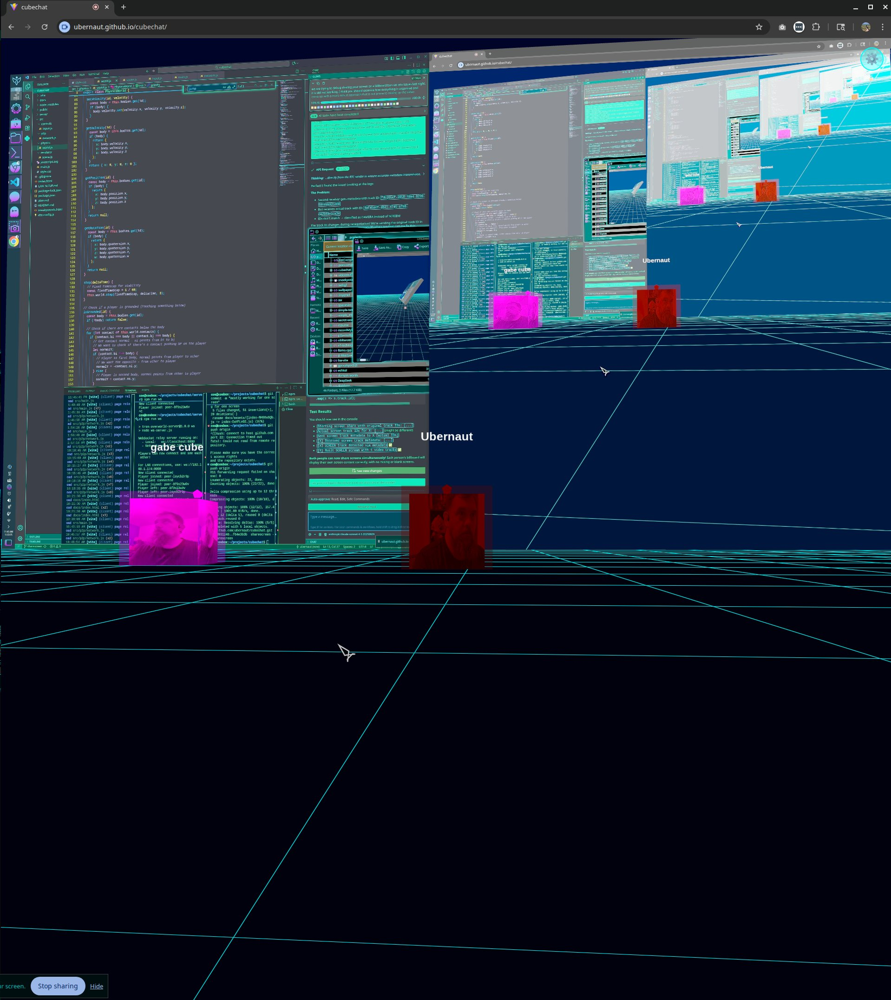

# CubeChat - P2P Multiplayer Video Chat World



A fully-functional peer-to-peer multiplayer 3D world with integrated video chat and screen sharing. Players can move around a Tron-themed infinite grid, see and hear each other through WebRTC video/audio streams, and share their screens on virtual billboards.

## Features

### 🌐 P2P Multiplayer
- **WebSocket Relay Server**: Efficient signaling for peer discovery and connection
- **WebRTC Video/Audio**: Real-time video and audio streaming between players
- **Proximity-Based Connections**: Automatic video connection/disconnection based on player distance
- **Automatic Reconnection**: Robust connection handling with exponential backoff

### 🎥 Screen Sharing
- **Virtual Billboards**: Share your screen on large virtual billboards in the 3D world
- **Multiple Simultaneous Shares**: Support for multiple players sharing screens at once
- **Accurate Track Management**: Robust system to prevent video stream mix-ups
- **Billboard Positioning**: Position your billboard at your current location

### 🎮 3D World
- **Tron-Themed Environment**: Dark infinite grid with glowing cyan lines
- **Physics Engine**: Realistic physics with gravity, jumping, and collision detection
- **Smooth Movement**: WASD movement with rotation-relative direction
- **Camera Controls**: Free-look camera with arrow key rotation
- **Player Avatars**: Colored cubes with real-time video textures on their faces

### 🎨 Visual Features
- **Video Textures**: Player video streams rendered on cube faces
- **Glowing Effects**: Neon glow effects on players and grid lines
- **Dynamic Billboards**: Screen shares displayed on large billboards with proper aspect ratios
- **Smooth Animations**: Interpolated player movement for fluid visuals

## Project Structure

```
cubechat/
├── src/
│   ├── p2p/
│   │   └── network.js       # WebRTC P2P networking with video/audio
│   ├── renderer/
│   │   └── scene.js         # Three.js scene, players, and billboards
│   ├── physics/
│   │   └── world.js         # Physics engine with collision detection
│   ├── controls/
│   │   └── input.js         # Player input handling
│   ├── main.js              # Main application orchestration
│   └── style.css            # Tron-themed styling
├── server/
│   ├── server.js            # HTTP server for serving the app
│   └── ws-server.js         # WebSocket relay server for P2P signaling
├── index.html               # Main HTML entry point
└── package.json             # Dependencies and scripts
```

## Controls

### Movement
- **W**: Move forward
- **S**: Move backward
- **A**: Strafe left
- **D**: Strafe right
- **Space**: Jump
- **Shift**: Sprint (faster movement)

### Camera
- **Left Arrow**: Rotate camera left
- **Right Arrow**: Rotate camera right
- **Up Arrow**: Look up
- **Down Arrow**: Look down

### Screen Sharing
- **B**: Toggle screen share billboard at current location
- **ESC**: Stop screen sharing

## Getting Started

### Development Mode

1. Install dependencies:
```bash
npm install
cd server && npm install && cd ..
```

2. Start the WebSocket relay server:
```bash
cd server
npm start
```

3. In a new terminal, start the development server:
```bash
npm run dev
```

4. Open multiple browser windows to `http://localhost:5173` to test multiplayer

### Production Mode

1. Build the application:
```bash
npm run build
```

2. The production files are in the `docs/` directory

3. Deploy to a web server with WebSocket support

## Technical Details

### P2P Networking (`src/p2p/network.js`)
- **WebRTC Peer Connections**: Direct peer-to-peer connections for video/audio
- **Data Channels**: For position updates and metadata
- **Track Management**: Separate handling of camera and screen share tracks
- **Renegotiation**: Proper handling of adding/removing tracks dynamically
- **Metadata Sync**: Track IDs sent via data channels for accurate stream classification

### Video Streaming
- **Camera Streams**: getUserMedia for video/audio capture
- **Screen Streams**: getDisplayMedia for screen sharing
- **Track Separation**: Camera and screen tracks kept separate to prevent mixing
- **Stream Rebuilding**: Dynamic stream reconstruction when tracks are added/removed

### Physics Engine (`src/physics/world.js`)
- **Gravity**: Realistic falling and jumping
- **Ground Collision**: Players stay on the ground plane
- **Velocity Management**: Smooth acceleration and deceleration
- **Sprint Mechanics**: Speed boost when holding shift

### 3D Rendering (`src/renderer/scene.js`)
- **Three.js Scene**: WebGL rendering with efficient geometry
- **Video Textures**: Real-time video rendering on cube faces
- **Billboard System**: Large planes for screen sharing
- **Distance Culling**: Efficient rendering of distant objects
- **Glow Effects**: Post-processing for neon aesthetic

### Modular Architecture
- **ES6 Modules**: Clean separation of concerns
- **Event-Driven**: Message handlers for network events
- **State Management**: Centralized player and stream state
- **Extensible Design**: Easy to add new features

## Server Deployment

### Local Network (LAN)
For local network testing, see [LAN_SETUP.md](LAN_SETUP.md)

### Production
The application auto-detects the environment:
- **Development**: Uses `ws://localhost:8080`
- **Production**: Uses `wss://secretworkshop.net/cubechat/`

You can override the WebSocket server URL with the `VITE_WS_SERVER` environment variable.

## Browser Requirements

- Modern browser with WebRTC support (Chrome, Firefox, Edge, Safari)
- Camera and microphone permissions
- Screen sharing API support (for billboard feature)

## Known Limitations

- Maximum of ~10-15 simultaneous video connections (browser WebRTC limits)
- Proximity-based connection management (400 unit radius)
- Screen share requires HTTPS in production

## Future Enhancements

- Voice activation indicators
- Text chat system
- Avatar customization
- Persistent world state
- Mobile device support
- VR/AR integration

## License

MIT

## Credits

Built with:
- [Three.js](https://threejs.org/) - 3D rendering
- [Vite](https://vitejs.dev/) - Build tool
- [WebRTC](https://webrtc.org/) - Real-time communication
- [ws](https://github.com/websockets/ws) - WebSocket library
